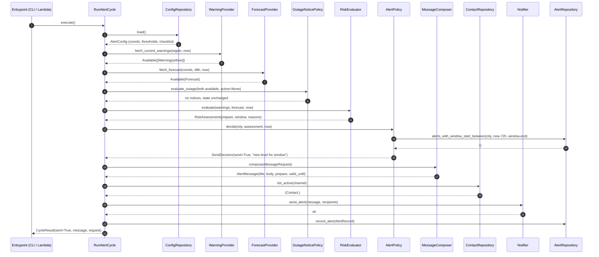
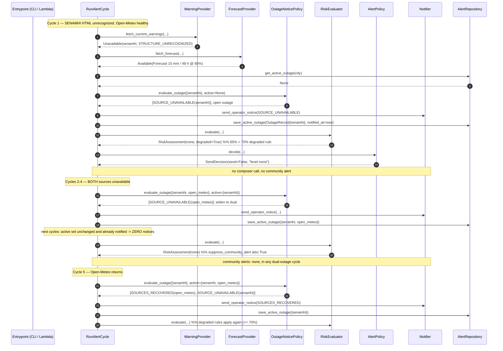

# Design: Core Alert Cycle (Local, No Cloud)

Source of truth: `docs/superpowers/specs/2026-09-03-rain-alert-core-design.md` (section 3 decisions are closed; section 10.1 fixes the layout). System diagram: `docs/rain-alert-core-architecture.drawio` — not duplicated here. Scope and slicing: `proposal.md`. Behaviour: `specs/*/spec.md`.

This document pins the **contracts that changes 2 and 3 consume**. Anything marked *contract* is breaking to change after this slice merges.

---

## 1. Technical Approach

Hexagonal, domain-first, strict TDD. Three rings:

| Ring | Package | May import | Never imports |
|---|---|---|---|
| Domain | `src/rain_alert/domain/` | stdlib only | ports, adapters, entrypoints, any third party |
| Ports | `src/rain_alert/ports/` | `typing`, domain types | adapters, third party |
| Edges | `src/rain_alert/application/`, `adapters/`, `entrypoints/` | ports, domain, third party | — |

Two structural rules carry most of the design's weight:

1. **Every rule is a pure function; every port-bound object is a thin shell over one.** `AlertPolicy` and `OutageNoticePolicy` hold a port reference so they can satisfy the specs literally ("MUST query `AlertRepository`"), but each delegates to a module-level pure function that takes state in and returns a decision out. All rule tests are table-driven with no fakes at all.
2. **Availability is a value, not an exception.** Source outage is reasoned about in five rule branches and three notice branches, so it travels as data.

The LLM composer invariant (design spec 3.2) is preserved structurally: `MessageComposer` is invoked by `RunAlertCycle` **after** `AlertPolicy` has already authorized the send, receives a `MessageRequest` that already contains the decided level, and its return value never feeds back into any decision.

---

## 2. Architecture Decisions

### D1 — Domain types are frozen stdlib dataclasses

**Choice**: `@dataclass(frozen=True, slots=True)` + `StrEnum`, stdlib only.
**Rejected**: Pydantic (adds a third-party dependency to the pure core and megabytes to the change-3 Lambda bundle; boundary validation belongs in adapters, hand-written); `NamedTuple` (positional access leaks into call sites, no `__post_init__` invariant hook); mutable dataclasses (assessments are passed to composer and notifier — immutability removes a whole class of bug).
**Rationale**: value equality makes table-driven assertions one line (`assert evaluate(...) == RiskAssessment(...)`); `frozen` makes them safe to share; `StrEnum` serializes to DynamoDB/JSON in change 3 with no mapper and reads well in test failure output.

### D2 — `SourceResult` is a tagged union, not an optional-data record

```python
type SourceResult[T] = Available[T] | Unavailable   # PEP 695, Python 3.12+
```

**Rejected**: one record with `status` + `data: T | None` (every reader must re-check the invariant and type checkers cannot narrow); raising on failure (would put degraded-mode control flow into `try/except` in the use case and make the four degraded rule branches awkward to test).
**Rationale**: `Unavailable` has **no** `data` attribute, so unavailable data is unreadable by construction, and `match` narrows cleanly. `Unavailable.reason` is a machine-usable enum plus free text, which the operator notice and the CLI both need.

### D3 — `Notifier` has two methods, not one union method

**Choice**: `send_alert(message, recipients)` and `send_operator_notice(notice)`.
**Rejected**: a single `send(payload: AlertMessage | OperatorNotice)`.
**Rationale**: the two calls differ in audience, payload shape (alerts need a recipient list; notices go to the single operator), and routing. A union would force every adapter to `match` on the payload type — the split *is* the real seam. In change 3 it lets operator notices go to Telegram while community alerts go elsewhere, with no branching inside an adapter. Cost is two trivial methods per adapter.

### D4 — HTTP client: `httpx` (sync)

| Option | Trade-off | Decision |
|---|---|---|
| `httpx` | Granular `Timeout(connect=, read=)`; **`MockTransport` gives an offline test seam with no extra test dependency**; pure-Python dep chain | **Chosen** |
| `requests` | Coarser timeout API; needs `responses`/`requests-mock` as an extra dev dependency for the same seam | Rejected |
| stdlib `urllib.request` | Zero deps, smallest bundle, but hand-rolling timeouts, status/error mapping and a test seam costs more code than the dependency saves | Rejected |

Installed size is comparable to `requests`; the test seam decided it. *To verify at apply: measured wheel size against the change-3 Lambda package budget.*

### D5 — HTML parsing: `beautifulsoup4` on the stdlib `html.parser`

| Option | Trade-off | Decision |
|---|---|---|
| `beautifulsoup4` + `html.parser` | **Pure Python — no compiled wheel, simplest Lambda packaging**; most tolerant of malformed markup; most readable row/cell extraction | **Chosen** |
| `lxml` | Fast and XPath-capable, but a C extension needing an architecture-matched manylinux wheel and ~10 MB | Rejected |
| `selectolax` | Fastest, also compiled | Rejected |

**Rationale**: one page every six hours makes parse speed irrelevant; packaging simplicity and malformed-HTML tolerance are what actually matter. Runtime dependency footprint for this change is therefore exactly two packages: `httpx`, `beautifulsoup4`.

### D6 — Ports are bundled into `CycleDependencies`

Seven ports plus an evaluator, two policies and a clock would give `RunAlertCycle` ten constructor parameters. Instead one frozen `CycleDependencies` bundle is injected. **Rejected**: a service locator or global registry (hides the graph, breaks per-test substitution); splitting `RunAlertCycle` into sub-use-cases (the seven-port count is fixed by spec 10.1, not by mixed responsibilities — the use case has exactly one reason to change).
**Rationale**: keeps constructor injection, makes CLI and change-3 Lambda wiring a single object, and makes test wiring one call: `build_fake_deps(forecast=Unavailable(...))`.

### D7 — Time is injected as a `Clock`, not frozen by a library

`CycleDependencies.now: Callable[[], datetime]`. **Rejected**: `freezegun` (a dev dependency to work around a design flaw); calling `datetime.now()` inside the domain (untestable). All domain datetimes MUST be timezone-aware UTC, enforced in `__post_init__`; conversion to `America/Lima` happens only for display, in the template and the CLI, using stdlib `zoneinfo` with the tz name from config. *To verify at apply (change 3): whether the Lambda runtime ships the system tz database or `tzdata` must be added.*

### D8 — Python floor 3.12

`requires-python = ">=3.12"`. Needs 3.12 for PEP 695 generic/type-alias syntax (D2) and 3.11 for `StrEnum` (D1). 3.12 is the conservative floor among AWS Lambda managed Python runtimes; nothing in the code is forward-incompatible, so a later bump is non-breaking. *To verify at apply of change 3: the exact set of managed Lambda Python runtimes then available.*

### D9 — `mypy --strict` on `src/` is added to the tooling list

The proposal lists `uv`, `pytest`, `ruff`. **Design position: add `mypy`.** Without a static checker, `typing.Protocol` ports are decorative — nothing would catch an adapter in change 3 drifting from a signature, which is precisely the risk the proposal flags ("changing a port after change 1 merges is a breaking change"). This is the cheapest possible guard on the artefact this whole change exists to produce. Recorded as an open question for owner confirmation (§10).

### D10 — Probability aggregation is `max` over the evaluated horizon

"≥ 9.5 mm in 48 h with probability ≥ 60 %" does not say *which* probability. **Choice**: the maximum hourly `precipitation_probability` over the evaluated horizon. **Rejected**: mean (dilutes a short intense storm to below threshold — the exact 2017 case the system exists for); probability of the single peak-precipitation hour (brittle to one-hour model noise). Kept as a documented domain constant, not a config knob, to avoid config sprawl; listed for calibration review (§10).

### D11 — Message preview without invoking the composer

Two specs pull in opposite directions: `alert-cycle` requires that a deduplicated cycle invoke **neither** composer nor notifier; `local-alert-cli` requires the CLI to print the message text on **every** run. Resolution: `CycleResult.message_request` is **always** populated, `CycleResult.message` only when a send was authorized. On a non-send the CLI renders the preview itself by calling the deterministic template on `message_request`, labelled `PREVIEW (NOT SENT)`. The agent in change 2 is therefore never invoked for a preview, and no cost is incurred on a deduplicated cycle.

### D12 — No retries in this slice

A failed fetch yields `Unavailable` immediately. **Rationale**: the degraded path is a first-class, fully tested behaviour, the cycle repeats in six hours, and the retry budget cannot be chosen sensibly before the change-3 Lambda timeout is known. Revisit in change 3.

---

## 3. Domain Types (*contract*)

```python
# domain/values.py
class Level(StrEnum):            NONE = "none"; PREPARE = "prepare"; IMMINENT = "imminent"
class WarningLevel(StrEnum):     YELLOW = "yellow"; ORANGE = "orange"; RED = "red"
class SourceName(StrEnum):       SENAMHI = "senamhi"; OPEN_METEO = "open_meteo"
class NoticeKind(StrEnum):
    SOURCE_UNAVAILABLE = "source_unavailable"
    SOURCES_RECOVERED  = "sources_recovered"
    # change 2 adds: AGENT_FALLBACK_USED = "agent_fallback_used"
class UnavailableReason(StrEnum):
    TRANSPORT_ERROR = "transport_error"; TIMEOUT = "timeout"; BAD_STATUS = "bad_status"
    MALFORMED_PAYLOAD = "malformed_payload"; STRUCTURE_UNRECOGNIZED = "structure_unrecognized"
    NO_ROWS_EXTRACTED = "no_rows_extracted"; INSUFFICIENT_HORIZON = "insufficient_horizon"

LEVEL_RANK: Mapping[Level, int] = {Level.NONE: 0, Level.PREPARE: 1, Level.IMMINENT: 2}
def is_escalation(previous: Level, candidate: Level) -> bool: ...

@dataclass(frozen=True, slots=True)
class Coordinates:      latitude: float; longitude: float   # range-checked in __post_init__

@dataclass(frozen=True, slots=True)
class TimeWindow:                                            # both UTC (zero offset, enforced); end > start
    start: datetime; end: datetime
    def overlaps(self, other: TimeWindow) -> bool: ...
    def key(self) -> str: ...                                # "<start ISO8601 UTC>" — the dedup sort key

# domain/reasons.py — the audit trail as data, not as prose (see 3.1)
class ReasonKind(StrEnum):
    OFFICIAL_WARNING = "official_warning"; FORECAST_THRESHOLD = "forecast_threshold"
    SENAMHI_UNAVAILABLE = "senamhi_unavailable"; NO_QUALIFYING_WARNING = "no_qualifying_warning"

@dataclass(frozen=True, slots=True)
class WarningReason:              level: WarningLevel; title: str
@dataclass(frozen=True, slots=True)
class ForecastThresholdReason:                               # `hours` = horizon actually evaluated
    accumulated_mm: float; hours: int; probability_pct: int
    probability_threshold_pct: int | None = None             # operator-only detail
@dataclass(frozen=True, slots=True)
class SenamhiUnavailableReason: ...
@dataclass(frozen=True, slots=True)
class NoQualifyingWarningReason: ...

type Reason = WarningReason | ForecastThresholdReason | SenamhiUnavailableReason | NoQualifyingWarningReason
def render_reason_en(reason: Reason) -> str: ...              # operator / CLI audit line
def render_reasons_en(reasons: tuple[Reason, ...]) -> tuple[str, ...]: ...

# domain/sources.py
@dataclass(frozen=True, slots=True)
class Available[T]:    data: T; fetched_at: datetime; notes: tuple[str, ...] = ()   # §5.1.2
@dataclass(frozen=True, slots=True)
class Unavailable:     source: SourceName; reason: UnavailableReason; detail: str; observed_at: datetime
type SourceResult[T] = Available[T] | Unavailable
def status_of(result: SourceResult[Any]) -> str: ...          # "available" | "unavailable"

# domain/entities.py
@dataclass(frozen=True, slots=True)
class Warning:
    source_id: str; title: str; level: WarningLevel; region: str; window: TimeWindow; emitted_at: datetime

@dataclass(frozen=True, slots=True)
class HourlyPoint: at: datetime; precipitation_mm: float; probability_pct: int

@dataclass(frozen=True, slots=True)
class Forecast:                        # non-empty, contiguous hourly points; both enforced
    location: Coordinates; points: tuple[HourlyPoint, ...]
    @property
    def horizon_hours(self) -> int: ...                       # == len(points)
    def accumulated_mm(self, hours: int) -> float: ...        # every accessor raises unless
    def max_probability_pct(self, hours: int) -> int: ...     # 1 <= hours <= horizon_hours (D10)
    def peak_hour(self, hours: int) -> HourlyPoint: ...
    def precipitation_window(self, hours: int) -> TimeWindow: ...   # ends at last point + 1 h

@dataclass(frozen=True, slots=True)
class RiskAssessment:
    level: Level; window: TimeWindow; reasons: tuple[Reason, ...]
    senamhi_status: str; open_meteo_status: str; degraded: bool

@dataclass(frozen=True, slots=True)
class Contact: contact_id: str; channel: str; handle: str; consent_at: datetime | None

# domain/messages.py — mirrors design spec 7.2 / 7.4 exactly so change 2 maps 1:1
@dataclass(frozen=True, slots=True)
class ForecastSummary: mm_24h: float; mm_48h: float; peak_at: datetime; peak_probability_pct: int
@dataclass(frozen=True, slots=True)
class WarningSummary:  source_id: str; level: WarningLevel; title: str; window: TimeWindow

@dataclass(frozen=True, slots=True)
class MessageRequest:                                        # the composer's ONLY input; never raw series
    city: str; timezone: str; level: Level; window: TimeWindow; reasons: tuple[Reason, ...]
    forecast: ForecastSummary | None; warning: WarningSummary | None
    senamhi_status: str; open_meteo_status: str; checklist: tuple[str, ...]

@dataclass(frozen=True, slots=True)
class AlertMessage: title: str; body: str; level: Level; valid_until: datetime   # == spec 7.4

@dataclass(frozen=True, slots=True)
class AlertRecord:
    city_slug: str; level: Level; window: TimeWindow; sent_at: datetime
    message: AlertMessage; reasons: tuple[Reason, ...]
    senamhi_status: str; open_meteo_status: str; composer: str   # "template" | "agent"

@dataclass(frozen=True, slots=True)
class OutageRecord:                                          # at most one active per city
    city_slug: str; unavailable_sources: frozenset[SourceName]
    opened_at: datetime; notified_at: datetime | None
    def is_dual(self) -> bool: ...

@dataclass(frozen=True, slots=True)
class OperatorNotice:
    kind: NoticeKind; subject: str; body: str; sources: frozenset[SourceName]; occurred_at: datetime
```

### 3.1 Reasons are structured values with a renderer per audience

*Added 2026-09-04, from the slice-2 fresh-context review (finding C1).*

Originally `RiskAssessment.reasons` was `tuple[str, ...]` holding pre-formatted English. That made a genuine cross-spec conflict unresolvable: `alert-cycle` requires the composed body to include each reason, while `risk-evaluation`'s reasons are the **operator** audit trail the CLI prints in English (§9). The community body therefore rendered English audit strings — including an internal `(degraded threshold 70%)` fragment — under a Spanish `Motivos:` header, and stated the SENAMHI outage twice in two languages. Design spec 7.4 requires recipient-facing text in neutral Spanish.

**Resolution**: the evaluator emits `Reason` values carrying the numbers it decided on (mm, evaluated hours, probability, the stricter threshold when one applied, warning level and title). Two renderers consume them:

| Audience | Renderer | Contents |
|---|---|---|
| Operator, CLI (§9), `AlertRecord` audit trail, change 3 `--json` | `domain/reasons.render_reasons_en` | English, with every number and the threshold that applied |
| Community recipients | `domain/template.MessageComposer` | Neutral Spanish prose; no threshold values; window converted to `AlertConfig.timezone` per D7; the outage stated once |

The property that mattered is preserved: the branch that made the decision still builds the reason, so the audit trail cannot drift from the verdict. `Reason` is a tagged union rather than one record with optional fields, for the same reason as D2 — a `WarningReason` has no millimetre reading to misread, and `match` narrows.

### 3.2 Forecast horizon and window semantics

*Added 2026-09-04, from the slice-2 fresh-context review (findings C2, W1, W5).*

- `Forecast.__post_init__` rejects an empty `points` tuple. The "48 contiguous hourly points" invariant is now defended where it is claimed, instead of surfacing as a `max()` error inside `peak_hour`.
- Every accessor refuses a horizon outside `1..horizon_hours`. A 24-point forecast must not answer a 48-hour question, because the answer would be reported under an untruthful horizon.
- Callers that tolerate a short series clamp first, via `risk.evaluated_horizon(forecast, requested_hours)`, and report the clamped value. Clamping is conservative: an accumulation reached in fewer hours also clears the same threshold over a longer horizon, and max probability over fewer hours can only be lower or equal — so a truncated forecast can never make the system warn where a full one would not.
- `precipitation_window(hours)` ends **one hour after the last sample's timestamp**, because an hourly sample stamped 14:00 describes 14:00–15:00. The previous end-at-last-timestamp form under-reported coverage by an hour, so `AlertMessage.valid_until` declared expiry before the data ran out. A 48-point forecast now yields a 48-hour window, and a one-point cloudburst yields a valid one-hour window instead of aborting the cycle on `TimeWindow.end must be strictly after start`.

---

## 4. Ports (*contract* — `typing.Protocol`, structural, fakes do not subclass)

```python
class ConfigRepository(Protocol):
    def load(self) -> AlertConfig: ...

class WarningProvider(Protocol):
    def fetch_current_warnings(self, region: str, now: datetime) -> SourceResult[tuple[Warning, ...]]: ...

class ForecastProvider(Protocol):
    def fetch_forecast(self, location: Coordinates, hours: int, now: datetime) -> SourceResult[Forecast]: ...

class MessageComposer(Protocol):
    def compose(self, request: MessageRequest) -> AlertMessage: ...

class ContactRepository(Protocol):
    def list_active(self, channel: str) -> tuple[Contact, ...]: ...

class Notifier(Protocol):                                             # D3
    def send_alert(self, message: AlertMessage, recipients: tuple[Contact, ...]) -> None: ...
    def send_operator_notice(self, notice: OperatorNotice) -> None: ...

class AlertRepository(Protocol):
    # --- community-alert dedup ---
    def alerts_with_window_start_between(
        self, city_slug: str, earliest_start: datetime, latest_start: datetime
    ) -> tuple[AlertRecord, ...]: ...                                 # ascending by window start
    def record_alert(self, record: AlertRecord) -> None: ...
    # --- outage-notice dedup state ---
    def get_active_outage(self, city_slug: str) -> OutageRecord | None: ...
    def save_active_outage(self, record: OutageRecord) -> None: ...    # upsert
    def clear_active_outage(self, city_slug: str) -> None: ...
```

`@runtime_checkable` is deliberately not used: it only checks method *names*, giving false confidence. Conformance is guarded statically by D9.

### 4.1 `AlertRepository` key design → DynamoDB `alerts-sent` (design spec 9)

Both item kinds live in **one** table with a generic composite key, so change 3's adapter is a mechanical mapping with no GSI:

| Item | `pk` | `sk` | Attributes |
|---|---|---|---|
| Sent alert | `ALERT#<city_slug>` | `<window_start ISO8601 UTC>#<level>` | `window_end`, `sent_at`, `level`, `title`, `body`, `valid_until`, `reasons`, `senamhi_status`, `open_meteo_status`, `composer` |
| Active outage | `OUTAGE#<city_slug>` | `CURRENT` | `unavailable_sources`, `opened_at`, `notified_at` |

| Port method | DynamoDB call in change 3 |
|---|---|
| `alerts_with_window_start_between` | `Query(pk = "ALERT#<slug>", sk BETWEEN "<earliest>#" AND "<latest>#~")` |
| `record_alert` | `PutItem` |
| `get_active_outage` | `GetItem(pk = "OUTAGE#<slug>", sk = "CURRENT")` |
| `save_active_outage` | `PutItem` (single item, idempotent upsert) |
| `clear_active_outage` | `DeleteItem` |

Why a **range** query rather than "give me the last alert": overlap and escalation are *rules*, and rules belong in `AlertPolicy`. The store stays a dumb key-range read, which is both the cheapest DynamoDB access pattern and trivially fakeable. Window start is the sort key precisely so the dedup lookback is a native sort-key range.

The local `JsonFileAlertRepository` persists the same two collections (`alerts: [...]`, `active_outage: {...} | null`), so the file adapter and the DynamoDB adapter are shape-identical.

---

## 5. Configuration and `RiskEvaluator`

```python
@dataclass(frozen=True, slots=True)
class RiskThresholds:
    prepare_mm_48h: float                       # 9.5  — Reque p95 boundary
    prepare_probability_pct: int                # 60
    prepare_probability_pct_degraded: int       # 70   — SENAMHI unavailable
    prepare_warning_levels: frozenset[WarningLevel]   # {yellow, orange, red}
    imminent_mm_24h: float                      # 20.0
    imminent_probability_pct: int               # 70
    imminent_warning_levels: frozenset[WarningLevel]  # {orange, red}

@dataclass(frozen=True, slots=True)
class AlertConfig:
    city: str; city_slug: str; coordinates: Coordinates; timezone: str
    region: str; thresholds: RiskThresholds
    checklist: tuple[str, ...]; active_channel: str
    forecast_hours: int                         # 48
    dedup_lookback_hours: int                   # 72
    coordinates_are_placeholder: bool           # True until design spec 12 is closed
```

`RiskEvaluator(thresholds)` is constructor-injected with values loaded from `ConfigRepository` by the use case. No threshold, coordinate or probability literal appears anywhere in `domain/risk.py`.

Evaluation order (short-circuit, most severe first):

| # | Branch | Condition | Window |
|---|---|---|---|
| 1 | Imminent / official | SENAMHI available **and** any current warning level ∈ `imminent_warning_levels` **and** that warning `may_raise_imminent` (§5.1.1 — a highlands-only warning does not) | warning window (union if several) |
| 2 | Imminent / forecast | Open-Meteo available **and** `accumulated_mm(24) >= imminent_mm_24h` **and** `max_probability_pct(24) >= imminent_probability_pct` | `precipitation_window(24)` |
| 3 | Prepare / combined | both available, warning level ∈ `prepare_warning_levels`, `accumulated_mm(48) >= prepare_mm_48h`, `max_probability_pct(48) >= prepare_probability_pct` | union(warning window, `precipitation_window(48)`) |
| 4 | Prepare / forecast-only | SENAMHI **available** with **no** warning level ∈ `prepare_warning_levels`, Open-Meteo available, `accumulated_mm(48) >= prepare_mm_48h`, `max_probability_pct(48) >= prepare_probability_pct_degraded` | `precipitation_window(48)` |
| 5 | Prepare / degraded | SENAMHI **unavailable**, Open-Meteo available, `accumulated_mm(48) >= prepare_mm_48h`, `max_probability_pct(48) >= prepare_probability_pct_degraded` | `precipitation_window(48)` |
| 6 | None | anything else, including both sources unavailable | the evaluated horizon from `now` |

Every `48` and `24` above is the **requested** horizon; the evaluator clamps it to `forecast.horizon_hours` first and reports the clamped value (§3.2).

Branches 1 and 2 are independent, so `imminent` still fires when the other source is down (spec 6.3). `prepare` cannot fire without forecast data. Both unavailable falls through to 6 by construction — there is no branch that can be reached without at least one `Available`. `degraded=True` whenever either status is `unavailable`; in branch 5 the reasons tuple always includes the explicit `SenamhiUnavailableReason`, which the template surfaces in the body as one Spanish sentence.

**Branch 4 was added 2026-09-04** (owner-approved, from the slice-2 fresh-context review). Without it a healthy SENAMHI with zero warnings was strictly *less* sensitive than a broken one: 24 mm / 48 h at 95 % yielded `none` when SENAMHI was available and silent, but `prepare` when SENAMHI was unavailable via branch 5. Breaking the scraper must never make the system more likely to warn. Branch 4 fires at the same stricter probability threshold branch 5 uses — never at the combined-rule 60 %, because there is no official confirmation to combine with — and its reasons (`NoQualifyingWarningReason` + a `ForecastThresholdReason` carrying that threshold) state that there is no official warning and that the trigger was forecast-only. It is unreachable when a qualifying warning exists, because branch 3 owns that case. A parametrized monotonicity test asserts that for identical forecast data a healthy silent SENAMHI is never less sensitive than an unavailable one.

### 5.1 Only flood-relevant official warnings reach the evaluator

*Added 2026-09-04, owner-approved, from the live page inspected during slice-3 apply.*

**The design assumed the Lambayeque warnings page is a rain-warning feed. It is not.** It is a multi-hazard feed. Of the 788 rows live on 2026-09-04: ~233 wind, ~131 daytime/nighttime temperature, ~137 precipitation, plus others. The single warning **in force** that day was a **RED `INCREMENTO DE TEMPERATURA DIURNA EN LA COSTA Y SIERRA`** — a heat warning.

Branch 1 above raises `imminent` on *any* current warning whose level is in `imminent_warning_levels`. So with the scraper wired up exactly as §8.2 specified, the first live cycle would have told the entire Ferreñafe community that flooding was imminent because of a heat wave. This is the highest-severity failure mode the whole system has: a false alarm destroys the credibility the design's own §11 disclaimer depends on.

Two owner-approved rules therefore stand between the page and the evaluator. They answer **different questions**, which is the correction made on 2026-09-04 (see 5.1.1):

| # | Rule | Question | Keeps | Bars |
|---|---|---|---|---|
| 1 | `is_flood_relevant(phenomenon)` | may this warning drive a flood alert **at all**? | `PRECIPITACIONES ...`, `LLUVIA ...`, `LLOVIZNA ...`, `GARÚA ...` | `INCREMENTO DE VIENTO ...`, `INCREMENTO DE [LA] TEMPERATURA ...`, `DESCENSO DE [LA] TEMPERATURA ...`, `... FRIAJE ...`, `NEVADA ...`, `GRANIZO ...` |
| 2 | `may_raise_imminent(phenomenon, zone)` | may it, **on its own**, claim flooding is imminent? | titles naming the coast (`EN LA COSTA`, `EN LA COSTA NORTE Y SIERRA`, `EN COSTA NORTE Y SIERRA`), and titles naming no zone | titles exclusively about the highlands (`EN LA SIERRA`, `EN LA SIERRA NORTE Y CENTRO`) |

**Where the rule lives.** Split across two modules, on the layer boundary:

| Concern | Home | Why |
|---|---|---|
| `Phenomenon` / `Zone` enums, `is_flood_relevant(phenomenon)` and `may_raise_imminent(phenomenon, zone)` | `domain/hazards.py` | These are *rules* about which hazards can flood this city and how fast. Pure, table-testable, reviewable in one screen. |
| `classify_phenomenon(title)` / `classify_zone(title)` | `adapters/senamhi_classification.py` | Spanish aviso wording is the *source's* vocabulary, not the domain's. Adapters translate external vocabulary into domain terms. |

`Warning` gained `phenomenon: Phenomenon = UNKNOWN` and `zone: Zone = UNKNOWN` plus `is_flood_relevant` and `may_raise_imminent` properties, so the classification travels with the value and the decision is inspectable rather than hidden inside whichever code filtered it. The classification module is deliberately *not* a private helper inside the scraper: this filter decides what the community is ever told, so it needs a first-class test seam and a diff a reviewer can read.

**Every family SENAMHI publishes is classified.** `UNKNOWN` is treated as flood-relevant, so an unclassified family is a hole rather than a neutral gap: `NEVADA` and `GRANIZO` would reach the evaluator as if they were rain. A harvest of 12 399 rows across the 12 regional pages on 2026-09-04 leaves zero titles unclassified. `GRANIZO` carried no live row that day and is classified anyway, because one pattern is cheaper than the hole.

**Markers are patterns, not phrases.** The first implementation tested fixed phrases with a plain `in`. SENAMHI publishes the same aviso family both as `INCREMENTO DE TEMPERATURA DIURNA ...` and as `INCREMENTO DE LA TEMPERATURA DIURNA ...` — 56 rows across 9 of the 12 regional pages used the article form — and the second is not a substring of the first, so it classified as `UNKNOWN` and the heat aviso the filter exists to stop reached the evaluator. Markers now honour word boundaries and the optional article. Word-boundary matching also means `COSTADO` is not read as `COSTA` and `TEMPERATURAS` in prose is not read as the aviso family.

**Where the filter is applied.** At the adapter boundary — the scraper returns only warnings that are both in force and flood-relevant. Considered and rejected: filtering inside the evaluator instead. That would require branches 1, 3 and 4 *and* `_build_message_request`'s `_most_severe_warning` to each remember to filter — four sites, any one of which could forget and put a heat warning in front of a recipient. Filtering once, where irrelevant data enters the system, is fail-safe by construction, and matches §8.2's existing posture that a source adapter never hands the domain something it must re-validate.

**Conservative on the unknown, deliberately asymmetric.** `UNKNOWN` phenomenon is treated as *relevant*, and `UNKNOWN` zone as *reaching the coast*. A `HIGHLANDS` classification is a positive statement that the coast is not covered; `UNKNOWN` only means the title did not say. Missing a real flood warning is far worse than raising one extra alert, so the unknown case fails towards alerting. The default field values are `UNKNOWN` for the same reason: a caller that forgets to classify over-alerts, it does not go silent.

**Matching is normalized, never exact.** Accent-stripped, upper-cased, whitespace-collapsed, word-boundary matching. An exact-string or substring map silently drops real warnings, which is the worst possible failure for this filter — and did, until 2026-09-04.

**Residual risk, accepted:** any mention of the coast qualifies, including `COSTA SUR` (1 row of 789). Narrowing to the north coast would add a way to miss a real warning, which the conservative posture above rules out.

Behaviour is pinned by requirements in `specs/weather-sources/spec.md` ("Only flood-relevant official warnings may drive an alert", "Only warnings currently in force may drive an alert", "An unparseable row in force is a structural failure") and in `specs/risk-evaluation/spec.md` ("A highlands-only official warning is an early signal"). §8.2's scraper contract is unchanged except that its "current" filter is now `in force AND flood-relevant`.

### 5.1.1 Highlands rain is an early signal, not an imminence claim

*Added 2026-09-04, owner-approved, from the slice-3 fresh-context review.*

The geography rule above originally discarded highlands-only rainfall outright. Measured against the live page that removes **144 of the 243 precipitation rows**, and `PRECIPITACIONES EN LA SIERRA` is the single most common precipitation title on the page at **78 rows**. The hydrology says that is the wrong call:

- The Río La Leche rises at 4 230 m on Mount Choicopico, **inside Ferreñafe province**, and flows west through Ferreñafe and Lambayeque provinces.
- SENAMHI measures its critical level at the **Puchaca station in Incahuasi**, a sierra district *of Ferreñafe province*, and explicitly attributes rises there to intense rain in the basin headwaters.
- Riverside defence works protect Pítipo and Incahuasi (Ferreñafe province) plus Pacora, Íllimo and Jayanca.
- This river routing is the mechanism behind the 2017 flooding of Ferreñafe.

Sierra rain is therefore upstream of the city with hours of lead time — the earliest signal this system can get — and discarding it threw that signal away.

**The corrected rule**: highlands-only precipitation warnings are flood-relevant again, but as an **early** signal. They MAY contribute to `prepare` (branch 3, the combined rule, still counts them) and MUST NOT raise `imminent` on their own (branch 1 skips them, at any level). Coast and coast-plus-highlands warnings keep full weight including `imminent`. Ferreñafe city is coastal, so sierra rain reaches it by river routing rather than by falling overhead; claiming imminence on rain that has not yet run down the basin is the kind of false alarm that costs the credibility every future real warning depends on.

**Where it is enforced**: `_imminent_from_official` filters on `Warning.may_raise_imminent`; `_prepare_combined` does not. Two branches, one rule, and a cross-product test asserts `may_raise_imminent` can never exceed `is_flood_relevant`. The zone stays on the `Warning` value, so the decision is inspectable rather than implied by whichever code filtered it.

### 5.1.2 A broken parse of the row in force is an outage, not a calm

*Added 2026-09-04, from the slice-3 fresh-context review (finding C2).*

§8.2's structural guard is share-based: more than half the rows unparseable means the structure changed. That cannot defend the row that decides the cycle. Breakage confined to the single `(vigente)` row is 1 of 789 rows — 0.13% — so the guard waves it through and the adapter reports `Available(())`: a **silent false calm** while a red aviso is in force. The reviewer reproduced it by changing one cell, a start date becoming `2026-09-04 08:00`.

It is worse than a declared outage. Because `senamhi_status == "available"`, the evaluator routes to branch 4 at the stricter degraded probability threshold, so a broken parse leaves the system *less* sensitive than a source known to be down — and emits no operator notice at all.

**Rule**: an anomaly on a row carrying the in-force marker raises `FetchError(STRUCTURE_UNRECOGNIZED)`. Anomalies on rows not in force stay skippable, because a historical row cannot change the verdict. The marker is detected from the whole row's text when the cells cannot be trusted, which errs towards declaring failure — the safe direction.

**`Available` gained `notes: tuple[str, ...] = ()`.** The slice-3 record listed the discard audit as unsurfaceable because `WarningProvider` returns `SourceResult[tuple[Warning, ...]]`. That premise was wrong: `Available` is a plain frozen dataclass, so a defaulted field is purely additive, breaks no merged call site and keeps `mypy --strict` green. The scraper carries its discard reasons and a parse-anomaly summary through it, and §9's CLI prints them under a `Notes` block and in `--json`. With 5.1.2 in place this is not a nicety: it is where a partial parse failure becomes visible to a human.

Deliberately **not** built: a rule registry, predicate table or threshold DSL. Two levels and six branches do not clear the rule of three; explicit ordered branches are the readable, debuggable form. Each branch's condition lives in a small named helper returning a verdict or `None`, so the reasons tuple is produced by the same code that made the decision — the audit trail cannot drift from the verdict. Every numeric threshold is pinned by a boundary table (one case exactly at the value, one just below), because a `<` → `<=` flip previously kept the suite green for four of the six comparisons.

---

## 6. `AlertPolicy` and the Dual-Outage Rule

```python
# domain/dedup.py  — pure
def should_send(assessment: RiskAssessment, prior: tuple[AlertRecord, ...]) -> SendDecision: ...
# application-facing shell
class AlertPolicy:
    def __init__(self, alerts: AlertRepository, lookback_hours: int) -> None: ...
    def decide(self, city_slug: str, assessment: RiskAssessment, now: datetime) -> SendDecision: ...
```

`decide` reads `alerts_with_window_start_between(city_slug, min(now - lookback, assessment.window.start), assessment.window.end)`, then calls `should_send`. The range start is clamped to the assessment window's own start (**added 2026-09-04**, slice-2 review finding W2): an imminent window is the union of the current SENAMHI warning windows and can begin well before the lookback, so a long-duration aviso would otherwise hide the alert already sent for it and the community would be re-alerted every cycle. Clamping only widens the range, so the lookback still governs windows that start inside it. Rules: `level == NONE` → no; no overlapping prior record → yes (new); overlapping prior with `is_escalation(prior_max_level, level)` → yes; equal level → no; lower level → no. `SendDecision(send: bool, reason: str)` — the reason is printed by the CLI and logged in change 3.

```python
# domain/outage.py  — pure
def evaluate_outage(
    senamhi: SourceResult[...], open_meteo: SourceResult[...],
    active: OutageRecord | None, city_slug: str, now: datetime,
) -> OutageDecision: ...

@dataclass(frozen=True, slots=True)
class OutageDecision:
    notices: tuple[OperatorNotice, ...]
    next_state: OutageRecord | None      # None => clear
    state_changed: bool
    suppress_community_alert: bool       # True iff both sources unavailable
```

State transition table — this is the whole rule:

| Unavailable now | Active record | Notices | `next_state` |
|---|---|---|---|
| ∅ | none | — | none |
| ∅ | present | one `SOURCES_RECOVERED` | cleared |
| {A} | none | one `SOURCE_UNAVAILABLE` naming A | open, `notified_at = now` |
| {A} | same set, already notified | — (dedup) | unchanged |
| {A, B} | none | one `SOURCE_UNAVAILABLE` naming both | open dual, `notified_at = now` |
| {A, B} | `{A, B}`, already notified | — (dedup) | unchanged |
| {A} | `{A, B}` | one `SOURCES_RECOVERED` naming B **and** one `SOURCE_UNAVAILABLE` for the still-down A | narrowed to `{A}`, `notified_at = now` |
| {A, B} | `{A}` | one `SOURCE_UNAVAILABLE` naming the newly-down B | widened to `{A, B}` |
| any | **same set, `notified_at is None`** | one `SOURCE_UNAVAILABLE` naming the still-down set | unchanged set, `notified_at = now` |

The last row was **added 2026-09-04** (slice-2 fresh-context review, finding W4). `OutageRecord.notified_at` previously had no reader anywhere: rows 4 and 6 deduplicated on unavailable-set equality alone, so a record persisted with `notified_at=None` lost its notice forever — and change 3's adapter can produce exactly that state, because writing outage state and sending the notice are separate steps. An un-notified record means "still owed a notice", not "already told the operator". `state_changed` is `True` for this row.

`state_changed` is also the **only** gate `RunAlertCycle` uses to persist outage state (finding W3). Branching on `next_state is None` instead made every healthy cycle issue a redundant `clear_active_outage` and every unchanged ongoing outage re-save an identical record — a DynamoDB call every six hours, forever, for nothing.

**Where the state lives**: nowhere in the domain. `OutageRecord` is read from and written to `AlertRepository` by `RunAlertCycle` (`get_active_outage` / `save_active_outage` / `clear_active_outage`), which is why three consecutive dual-outage cycles emit exactly one notice even though each cycle is a fresh process. In this change the durable store is `JsonFileAlertRepository`; in change 3 it is the `OUTAGE#<slug>` / `CURRENT` item. The contract is identical, and the eight-row table above is the test matrix.

`suppress_community_alert` is redundant with the evaluator (dual outage already yields `NONE`, which `should_send` already refuses) and is enforced anyway as a hard guard in the use case — defence in depth on the one behaviour where a bug would send an unfounded alert to the community.

---

## 7. `RunAlertCycle`

```python
@dataclass(frozen=True, slots=True)
class CycleDependencies:                       # D6
    config: ConfigRepository; warnings: WarningProvider; forecast: ForecastProvider
    composer: MessageComposer; contacts: ContactRepository; notifier: Notifier
    alerts: AlertRepository
    evaluator_factory: Callable[[RiskThresholds], RiskEvaluator]
    now: Callable[[], datetime]                # D7

@dataclass(frozen=True, slots=True)
class CycleResult:
    config_city: str; senamhi: SourceResult[...]; open_meteo: SourceResult[...]
    assessment: RiskAssessment; decision: SendDecision
    message_request: MessageRequest            # ALWAYS populated — D11
    message: AlertMessage | None               # only when composed
    sent: bool; recipients_count: int
    notices: tuple[OperatorNotice, ...]

class RunAlertCycle:
    def __init__(self, deps: CycleDependencies) -> None: ...
    def execute(self) -> CycleResult: ...
```

Steps: (1) `config.load()` → (2) `warnings.fetch_current_warnings` → (3) `forecast.fetch_forecast` → (3b) `evaluate_outage` + persist state + send notices → (4) `evaluator.evaluate` → (5) `policy.decide` → (6) `composer.compose` → (7) `contacts.list_active` + `notifier.send_alert` + `alerts.record_alert`. Steps 6–7 run **only** when `decision.send` is true and `suppress_community_alert` is false. Recording happens strictly after successful notification.

### 7.1 Happy path — new `prepare`, both sources available



### 7.2 Degraded and dual-outage path



---

## 8. Adapters in This Change

### 8.1 `adapters/open_meteo.py`

| Aspect | Decision |
|---|---|
| Endpoint | `GET https://api.open-meteo.com/v1/forecast` — *to verify at apply; the hourly variable names are confirmed by design spec 5.2* |
| Query params | `latitude`, `longitude`, `hourly=precipitation,precipitation_probability`, `forecast_days=4`, `timezone=UTC` |
| Why `forecast_days=4` | the API returns whole days from today, so `2` leaves only 34 forward hours at 12:41 UTC. `3` clears 48 forward hours but has a **cliff at the end of the day**: at 23:00 UTC it yields exactly 49 points for a 48-hour need, so any clock skew or late publication drops the cycle to `insufficient_horizon`. `4` leaves a whole spare day at every hour, costs nothing, and removes the cliff. Raised from `3` on 2026-09-04 (slice-3 review, W4). The adapter still slices `[now_hour, now_hour + forecast_hours)`, so the extra day is never evaluated |
| Why `timezone=UTC` | slicing and window arithmetic stay unambiguous; local time is a display concern only (D7) |
| Timeouts | `httpx.Timeout(connect=3.0, read=5.0, write=3.0, pool=3.0)`; no retries (D12) |
| `Unavailable` when | transport error → `TRANSPORT_ERROR`; timeout → `TIMEOUT`; status ≠ 200 → `BAD_STATUS`; non-JSON body, missing `hourly.time` / `precipitation` / `precipitation_probability`, or unequal array lengths → `MALFORMED_PAYLOAD`; fewer than `forecast_hours` points at or after `now` → `INSUFFICIENT_HORIZON` |
| Never | returns a partially-filled `Forecast`. `Forecast.__post_init__` requires contiguous hourly points, so a gap is a parse failure, not silent interpolation |
| Attribution | Open-Meteo non-commercial terms noted in `README.md` (repo-hygiene spec) |

### 8.2 `adapters/senamhi_scraper.py`

| Aspect | Decision |
|---|---|
| Target | `https://www.senamhi.gob.pe/?dp=lambayeque&p=aviso-meteorologico` (design spec 5.1) |
| Fetch seam | an injected `HtmlFetcher` protocol (`fetch(url) -> str`). Parsing is therefore unit-tested with zero HTTP, and the httpx-backed fetcher is tested separately |
| Table location | **by header signature**, not by CSS class or table index: normalized (accent-stripped, lower-cased) header cell texts must contain the expected field set, then header text → column index is mapped and rows are read by that map. Class names and layout wrappers churn far more often than column headers, and an index-based selector fails silently where a signature check fails loudly. *Exact header labels to be captured from a live snapshot at apply.* |
| Level normalization | accent-stripped lower-case token map `amarillo→YELLOW`, `naranja→ORANGE`, `rojo→RED`; unknown token → row counted as an anomaly, not guessed |
| Date parsing | explicit `strptime` against an ordered list of accepted formats, in `America/Lima`, then converted to UTC; failure → row anomaly |
| "Current" filter | `window.start <= now <= window.end`. Historical rows still prove the parse worked, so they count toward the row check but are excluded from the returned tuple. This is what separates *healthy page, zero current warnings* → `Available(())` from *nothing parsed* → `Unavailable` |
| `Unavailable` when (spec 6.4) | table not found; header signature unrecognized → `STRUCTURE_UNRECOGNIZED`; zero data rows extracted → `NO_ROWS_EXTRACTED`; more than half of the extracted rows unparseable → `STRUCTURE_UNRECOGNIZED`; transport error/timeout → `TRANSPORT_ERROR` / `TIMEOUT`. Never `Available` with an empty list from a failed parse |
| Detail pages | **not fetched** in this change; `Warning.source_id` carries the ID so change 2's `get_warning_detail` tool can use it |
| Fixtures | `tests/fixtures/senamhi/`: `active_warning.html`, `history_only.html` (well-formed, none current), `broken_structure.html` (headers renamed / table replaced by divs), `empty_table.html` (headers present, zero rows). Captured verbatim once from the live page and pinned; a short `tests/fixtures/senamhi/README.md` records the capture date, URL and refresh procedure. A `@pytest.mark.integration` canary asserts the live page still matches the header signature — the early warning for breakage |

### 8.3 Other adapters

| Adapter | Notes |
|---|---|
| `adapters/console_notifier.py` | Prints to stdout with `[DRY-RUN ALERT]` / `[OPERATOR NOTICE]` prefixes. Prints the **recipient count only**, never handles or identifiers (hygiene spec). The module imports no HTTP client, so "never sends" is structural |
| `adapters/local/json_alert_repository.py` | `JsonFileAlertRepository` over `./.local-state/alerts.json` (gitignored), same two collections as §4.1. Atomic write via temp file + `os.replace` |
| `adapters/local/in_memory_alert_repository.py` | Same port, no I/O — the default in unit tests |
| `adapters/local/static_config_repository.py` | Builds `AlertConfig` from module constants + optional `RAIN_ALERT_LAT` / `RAIN_ALERT_LON` env overrides. Coordinates default to an **approximate placeholder** with `coordinates_are_placeholder=True` and a comment pointing at design spec §12 / `state.yaml → open_decisions.ferrenafe-coordinates`. The CLI prints `(PLACEHOLDER — pending confirmation)` beside the coordinates whenever the flag is set, and a unit test asserts the marker exists |
| `adapters/local/static_contact_repository.py` | Returns exactly one synthetic contact `Contact("operator-local", channel="console", handle="stdout")`. **No email address, no phone number, no `example.com`** — nothing that a hygiene grep must be taught to forgive |

---

## 9. Local CLI

```
uv run rain-alert-cycle [--json] [--now <ISO8601>] [--state-file PATH] [--offline-fixtures DIR]
# equivalently: uv run python -m rain_alert.entrypoints.cli
```

`[project.scripts] rain-alert-cycle = "rain_alert.entrypoints.cli:main"`.

**Dry-run guarantee is structural, not a flag.** The CLI's wiring can only construct `ConsoleNotifier`, and no sending notifier exists anywhere in this change's codebase. There is deliberately **no `--dry-run` flag**, because offering one would imply a send mode exists.

`--now` makes runs reproducible; `--state-file` points at a scratch dedup/outage state; `--offline-fixtures` runs the whole cycle against the pinned HTML and a recorded Open-Meteo payload with zero network access.

Output on **every** run, sent or not:

```
Ferreñafe  (-6.6400, -79.7900)  (PLACEHOLDER — pending confirmation)
Sources    senamhi: unavailable (structure_unrecognized: header signature not matched)
           open_meteo: available (fetched 2026-09-03T14:00:00Z)
Notes      - senamhi: discarded warning 345 (INCREMENTO DE TEMPERATURA DIURNA EN LA
             COSTA Y SIERRA): phenomenon high_temperature cannot cause flooding
Level      none   [degraded]
Window     2026-09-03T14:00Z → 2026-09-05T14:00Z
Reasons    - official SENAMHI source unavailable; forecast-only evaluation
           - 15.0 mm / 48 h at 65% max probability (required threshold 70%)
Decision   NOT SENT — level none
Message    PREVIEW (NOT SENT)
           title: ...
           body:  ...
Notices    1 emitted — source_unavailable (senamhi)
```

`--json` emits the same `CycleResult` as machine-readable JSON for calibration logging. **Exit code is 0 for any completed cycle**, including `none`, degraded and deduplicated outcomes; non-zero only on an unhandled internal error. A degraded cycle is the system working as designed, and a non-zero code would break any future cron or CI wrapper.

---

## 10. Testing Architecture (Strict TDD)

| Layer | What | How |
|---|---|---|
| Domain rules | evaluator branches, dedup rules, the eight outage transitions, template content | `@pytest.mark.parametrize` over frozen case dataclasses; `ids=` carry the **spec scenario names** so a failure names the requirement it broke. No fakes, no I/O, milliseconds |
| Use case | order of steps, dedup short-circuit, degraded wiring, record-after-notify, dual-outage suppression | `build_fake_deps(**overrides)` + hand-written recording spies that append typed call records **and share one ordered `CallLog`** (§10.1). `unittest.mock` deliberately avoided: `Mock` satisfies any Protocol and would hide exactly the drift we care about |
| Open-Meteo adapter | success slice, timeout, bad status, malformed payload, short horizon | `httpx.MockTransport` — offline, no extra dependency (D4) |
| SENAMHI parser | active warning, history-only, broken structure, empty table, unknown level token, unparseable dates | the four pinned fixtures + a stub `HtmlFetcher`. Parsing never touches the network |
| Repositories | round-trip, outage upsert/clear, atomic write | `tmp_path` fixture for the JSON adapter; the in-memory one is exercised by every use-case test |
| CLI | output contains level, reasons and message preview on a non-send run; console notifier never constructs an HTTP client | `capsys`, wired to fixtures via `--offline-fixtures` |
| Architecture | domain purity | see below |
| Integration (opt-in) | real Open-Meteo fetch; real SENAMHI header-signature canary | `@pytest.mark.integration`, **deselected by default** via `addopts = "-m 'not integration'"`; run with `uv run pytest -m integration` |

**Architecture test** — `tests/architecture/test_layer_boundaries.py` parses every module under `src/rain_alert/domain/` with `ast.parse` and fails on any `Import` / `ImportFrom` whose root module is in `{httpx, requests, urllib3, urllib.request, boto3, botocore, bs4, soupsieve, lxml, selectolax, strands, bedrock_agentcore, anthropic, openai, langchain}` or starts with `rain_alert.adapters` / `rain_alert.entrypoints` / `rain_alert.application`. A second case asserts `ports/` imports only `typing`, `collections.abc` and `rain_alert.domain`. Static AST inspection rather than import-and-introspect: it catches imports inside functions and `TYPE_CHECKING` blocks, and it runs without executing module side effects. The forbidden list is a module constant so change 2 and change 3 extend it in one line.

**Fake sharing between tests and the CLI** — two distinct categories, deliberately separated:

- **Local adapters that ship in `src/`** (`adapters/local/*`, `console_notifier`): real, supported implementations the CLI depends on. Tested like any adapter.
- **Recording spies that live in `tests/support/`** (`fakes.py`, `wiring.py`): test-only, they let tests assert call order and arguments. Exposed through `conftest.py` fixtures.

Both `tests/support/wiring.build_fake_deps()` and `entrypoints/wiring.build_local_deps()` return the same `CycleDependencies` type, so the object graph the CLI runs is the object graph the tests exercise — only the leaves differ. This is the reason D6 exists.

### 10.1 Cross-port call order is observable, not asserted by claim

*Added 2026-09-06, from the `sdd-verify` findings (W2).*

The original spies each owned a **private** call list. That is enough to answer "what was this port given" and not enough to answer "what happened before what", so the two ordering guarantees in `specs/alert-cycle/spec.md` — the steps run in the stated order, and an alert is recorded **only after** `Notifier` delivery — had no test that could fail. Verification proved it: moving `deps.alerts.record_alert(record)` above `deps.notifier.send_alert(...)` left all 537 tests green. That reordering is exactly the defect the requirement exists to prevent — an alert recorded but never delivered makes the next cycle believe the community was told, so the genuine alert is deduplicated away and never sent.

**Rule**: `build_fake_deps` creates one `CallLog` and hands the same instance to every leaf. Each spy appends `(port, method, detail)` to it in addition to its own typed list; `detail` is a short identifying string (city slug, level, message title) so a failure names which call it was. `CallLog.steps` gives the whole `(port, method)` sequence for a full-order assertion and `CallLog.position_of(port, method)` gives a relative-order one. The log is reachable from any leaf, e.g. `deps.notifier.log`.

The evaluator is part of the order the spec states, so `LoggingRiskEvaluator` **subclasses** `RiskEvaluator` and delegates the verdict to `super().evaluate(...)`. Subclassing rather than duck-typing keeps `CycleDependencies.evaluator_factory`'s declared return type honest, and delegating means the fake wiring never evaluates risk differently from production.

The per-port lists are kept. The two answer different questions, and collapsing them into the shared log would make every existing argument assertion read through a filter.

---

## 11. Project Layout and Tooling

```
pyproject.toml            uv project, hatchling backend, requires-python >= 3.12
uv.lock                   committed
.python-version           3.12
src/rain_alert/
  domain/     values.py entities.py sources.py messages.py reasons.py config.py risk.py dedup.py outage.py template.py
  ports/      __init__.py            (the seven Protocols)
  application/run_alert_cycle.py dependencies.py
  adapters/   open_meteo.py senamhi_scraper.py console_notifier.py http.py local/
  entrypoints/cli.py wiring.py
tests/        unit/{domain,application,adapters} architecture/ integration/
              fixtures/senamhi/ support/{fakes.py,wiring.py} conftest.py
LICENSE  README.md  .gitignore  .env.example
```

| Setting | Value | Rationale |
|---|---|---|
| `requires-python` | `>=3.12` | D8 |
| Runtime deps | `httpx`, `beautifulsoup4` | D4, D5 — two packages, chosen for the change-3 Lambda bundle |
| Dev deps | `pytest`, `ruff`, `mypy` | D9; `pytest-cov` omitted (`coverage_threshold: 0`), `freezegun` omitted (D7) |
| `[tool.pytest.ini_options]` | `testpaths=["tests"]`, `addopts="-q -m 'not integration'"`, `markers=["integration: hits real network sources (opt-in)"]` | the default suite is offline and fast, which is what strict TDD needs |
| Test packaging | `tests/` and every sub-directory carry an `__init__.py` | so `tests.support.*` (§10) resolves as a real dotted import with canonical module names, rather than through a `pythonpath` `sys.path` knob |
| `[tool.ruff]` | `line-length=120`, `target-version="py312"`, `select=["E","W","F","I","B","C4","UP","SIM"]`, `ignore=["E501"]`, formatter double quotes | project style skill |
| `[tool.mypy]` | `strict=true` on `src/`, relaxed `disallow_untyped_defs` for `tests.*` | D9 |
| Commands | `uv run pytest`, `uv run ruff check`, `uv run mypy src` | matches `openspec/config.yaml` (`mypy` is the added command per D9) |

`src/` layout so tests import the installed package and cannot accidentally pass by relative path. `.gitignore` covers `.env`, `.local-state/`, `.venv/`, `__pycache__/`, `.pytest_cache/`, `.ruff_cache/`, `.mypy_cache/`.

---

## 12. File Changes

| Path | Action | Slice |
|---|---|---|
| `pyproject.toml`, `uv.lock`, `.python-version` | Create | 1 |
| `LICENSE`, `README.md`, `.gitignore`, `.env.example` | Create | 1 |
| `src/rain_alert/{__init__,domain/__init__,ports/__init__,application/__init__,adapters/__init__,entrypoints/__init__}.py` | Create | 1 |
| `tests/architecture/test_layer_boundaries.py`, `tests/conftest.py` | Create | 1 |
| `src/rain_alert/domain/{values,entities,sources,messages,reasons,config}.py` | Create | 2 |
| `src/rain_alert/domain/{risk,dedup,outage,template}.py` | Create | 2 |
| `src/rain_alert/ports/__init__.py` (seven Protocols) | Modify | 2 |
| `src/rain_alert/application/{dependencies,run_alert_cycle}.py` | Create | 2 |
| `tests/unit/{domain,application}/**`, `tests/support/{fakes,wiring}.py` | Create | 2 |
| `src/rain_alert/adapters/{http,open_meteo,senamhi_scraper,console_notifier}.py` | Create | 3 |
| `src/rain_alert/adapters/local/*.py` | Create | 3 |
| `src/rain_alert/entrypoints/{wiring,cli}.py` | Create | 3 |
| `tests/unit/adapters/**`, `tests/fixtures/senamhi/**`, `tests/integration/**` | Create | 3 |

No file is modified or deleted outside this change's own slices; `openspec/` and `docs/` are untouched.

---

## 13. PR Slice Boundaries

Matches the proposal's estimate. Dependencies are strictly linear (3 → 2 → 1), which favours a chain where each child PR targets its parent. `sdd-tasks` owns the final forecast and the chain-strategy decision.

| Slice | Content | Est. lines | Autonomous verification | Rollback |
|---|---|---|---|---|
| 1 | uv/pytest/ruff/mypy scaffold, package skeleton, LICENSE, README disclaimers, `.gitignore`, `.env.example`, architecture boundary test (passes trivially on an empty domain) | ~150 | `uv run pytest`, `uv run ruff check`, `uv run mypy src`, hygiene `git grep` | revert; nothing depends on it |
| 2 | Domain types, seven ports, `RiskEvaluator`, `AlertPolicy`, outage rule, template composer, `RunAlertCycle`, `CycleDependencies`, spies, full offline unit suite | ~400 | all four design-spec 6.3 named scenarios, all dedup scenarios, all eight outage transitions green; domain purity test green | revert; slice 1 stands |
| 3 | Open-Meteo adapter, SENAMHI scraper + four fixtures, console notifier, local repositories/config, CLI + wiring, adapter tests, opt-in integration tests | ~450 | `uv run pytest`; `uv run pytest -m integration` run manually; CLI prints a real cycle sending nothing | revert only the adapter layer — domain, ports and use case survive, which is the proposal's stated rollback posture |

---

## 14. Migration / Rollout

No migration. Greenfield, no existing consumers, no external state written: the CLI writes only a gitignored local JSON file and never calls a notification channel. Rollout is `git revert` per slice.

---

## 15. Open Questions

- [ ] **Exact Ferreñafe coordinates** (design spec §12, `state.yaml → open_decisions.ferrenafe-coordinates`). Handled by an approximate placeholder + `coordinates_are_placeholder=True` + CLI marker + env override. Must be closed before change 3 writes SSM parameters.
- [ ] **D9: add `mypy` to the tooling list?** This exceeds the proposal's stated tooling (`uv`, `pytest`, `ruff`). Design position: yes — without a static checker the Protocol ports that changes 2 and 3 depend on are unenforced. Needs owner confirmation; if declined, record the unenforced-port risk explicitly.
- [ ] **D10: probability aggregation = `max` over the horizon.** A domain-level interpretation of an underspecified threshold. Revisit after the first rainy season's calibration data.
- [ ] *To verify at apply* — Open-Meteo endpoint path and exact query-parameter names (`forecast_days`, `timezone`); the hourly variable names are confirmed by design spec §5.2. No network tool was available to this phase.
- [ ] *To verify at apply* — the exact SENAMHI table header labels, from a live page snapshot, before the header-signature check is written.
- [ ] *To verify at change 3 apply* — the set of AWS Lambda managed Python runtimes then available (D8), and whether the runtime ships the system tz database or `tzdata` must be added as a dependency (D7).
- [ ] **Deferred to change 3 by design**: retry/backoff policy (D12), once the Lambda timeout budget is known.
